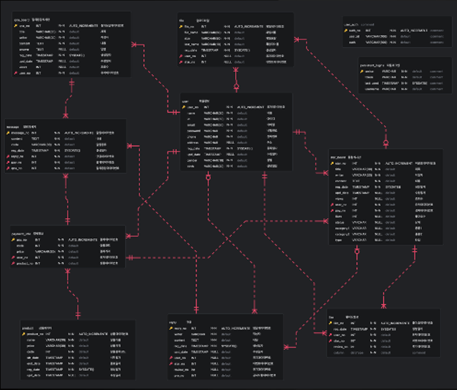

# 당스만_STARMAKERS
개인 프로모션 대행 서비스

## 기술 스택

## 소개

이 프로젝트는 크리에이터들의 컨텐츠 홍보 기능과 사용자들의 색다른 컨텐츠를 만나 볼 수 있게하는 사이트 이며, 크리에이터산업의 활성화를 위해 개발했습니다.

## 당스만 프로젝트
### 1. 프로젝트 개요
  - 프로젝스 소개
  - 기획 의도
### 2. 프로젝트 구조
  - 메뉴 구조도
### 3. 프로젝트 진행과정
  - 수행 절차 및 방법
  - 프로젝트 수행 결과
### 4. 프로젝트 결과물
  - 화면 설계
### 5. 개별 평가

# 1. 프로젝트 개요
## 1-1. 프로젝트 소개
- 크레이에터들은 오늘도 미디어산업에 뛰어듬.
- 하지만 대부분 알려지지 않고 사라짐.
- 꿈을 가진 크리에이터들의 도전적인 컨텐츠를 소개
- 새로운 컨텐츠를 찾는 이들과의 접점을 마련
## 1-2. 기획 의도
- 통합 프로모션
  - 여러 플랫폼의 통합
  - 다양한 콘텐츠를 쉽게 더 많은 사람들에게 노출
  - 교류를 위한 다양한 기능, 추가홍보, 활발한 커뮤니티

- 새로운 컨텐츠의 발굴
  - 새롭고 다양한 크리에이터들 발굴하고 응원할 수 있는 플랫폼
  - 자신만의 홍보 전략을 선택, 더욱 눈에 띄는 옵션을 제공
  - 독창적인 콘텐츠를 제작하고 성공할 수 있는 환경물 조성

## 2. 프로젝트 구조

<h3>ℹ️메뉴 구조도</h3>

  

## 3. 프로젝트 진행 과정

## 3-1. 수행 절차 및 방법

<h3>ℹ️수행 절차 및 방법</h3>

  

## 3-2. 수행 절차 및 방법

<h3>ℹ️프로젝트 수행 결과</h3>

  

## 요구사항 정의서

<h3>ℹ️요구사항 정의서</h3>

  
  
  

## 기능 정의서

<h3>ℹ️기능 정의서</h3>

  
  
  

## ERD

<h3>ℹ️ERD</h3>

  

## 테이블 정의서

<h3>ℹ️테이블 정의서</h3>

  
  
  
  

## 4. 프로젝트 결과물

## 화면 설계

<h3>ℹ️화면 설계</h3>

  

## 5. 개별 평가

- 조연진
  - 수업 시간에 배운 것을 프로젝트에 활용하며 자연스레 복습하게 되었고 그 과정에서 점점 더 능숙하게 프로그램을 다루는 스스로를 발견할 수 있었습니다. 
  처음 시도해본 것도 많아서 어려움도 있었지만 새로운 것을 배우고 활용하는 것이 즐거웠습니다.
  다양한 기능을 구현하다보니 막히는 부분도 있었지만 다른 팀원들과 협력하여 해결할 수 있었고 팀원과의 소통 또한 프로젝트 진행에서 중요한 부분임을 다시 한 번 깨달았습니다.

- 김유정
  - SpringBoot의 기본 CRUD를 발전시켜 하나의 테이블에서 여러 게시판을 통합하고, type 별로 목록을 구성하고 페이징, 검색 기능을 구현하며 복습과 함께 새로운 지식을 습득할 수 있는 기회를 얻었습니다. 
  댓글기능을 구현하며 비동기 방식에 대한 이해를 넓힐 수 있었습니다.
  깃을 사용하여 팀원과 훨씬 더 빠른 소통을 할 수 있었고, 협업의 즐거움을 느낄 수 있었습니다.
  팀원분들의 도움을 받은 점이 많아 팀워크에 대한 소중함을 다시 한 번 느꼈고, 앞으로의 공부에 대한 의지를 다잡았습니다.

- 김슬기
  - 페이지를 반응형으로 구현하기 위해서 부트스트랩을 배워서 적용했습니다. 처음에는 오래 걸리던 작업들도 익숙해지니 편해졌습니다.
  타임리프를 활용하여 레이아웃을 구성할때부터 잘 되지 않아 난감했었지만 잘 해결해나갈 수 있었습니다.
  깃을 활용하여 팀원들과 협업에 편리함을 느낄 수 있었습니다.
  프로젝트의 아이디어를 제안자로서 부담감이 있었지만 좋은 팀원들을 만나서 성공적으로 프로젝트를 완료 할 수 있게 되었습니다.
  
- 신준수
  - 이번 프로젝트에서 마이페이지 부분을 맡았는데 결제 내역을 가져온다거나 게시글을 선택 삭제 하는 기능 등, 배운지 얼마안된 기술들을 구현 하다보니 많은 어려움이 있었던 것 같습니다.
   이전 프로젝트 때에 비해 더 성장한 것 같았지만 아직 부족한 느낌이 많이 들었습니다. 다만 이번 프로젝트 때 좋았던 점은 깃을 활용하여 팀원들과 같이 협업하는 것이 이런거구나 라는 것을 많이 느꼈습니다. 
  프로젝트 패키지들을 도메인 형식으로 나누니 깃에서 충돌되는 것도 많이 없었고 원만하게 잘 이루어졌던 것 같습니다.
  
- 홍성
  - 무더운 여름이였어요.. 우리에게 시간은 마치 방금 떠난 버스처럼 뒤따라가기 바빴죠 우리의 의지는 강했으나 마음같지 않은 다리는 그 버스에 타지 못했던것 같아요.. 하지만 그 한걸음 한걸음은 중요했고, 더뎌도 차근차근 가려 노력했습니다. 생각했던 기능을 모두 적용하진 못했지만 주어진 시간에 최선을 다했다고 생각하고 팀원들 역시 그렇다고 생각합니다. 아니, 그 이상이라고 하면 더 좋을거 같아요
