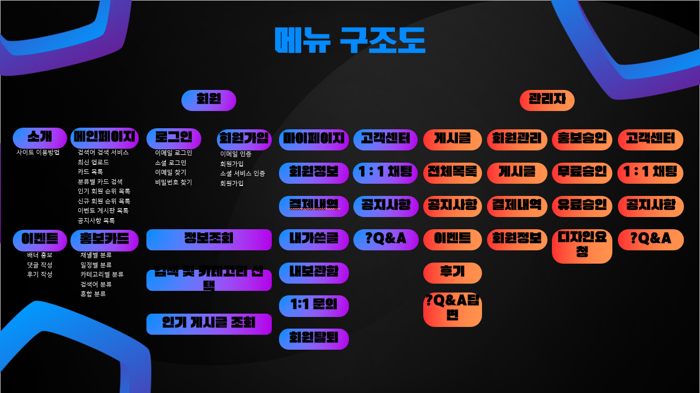

# 당스만_STARMAKERS
개인 프로모션 대행 서비스

## 기술 스택

## 소개

이 프로젝트는 크리에이터들의 컨텐츠 홍보 기능과 사용자들의 색다른 컨텐츠를 만나 볼 수 있게하는 사이트 이며, 크리에이터산업의 활성화를 위해 개발했습니다.

## 당스만 프로젝트
### 1. 프로젝트 개요
  - 프로젝스 소개
  - 기획 의도
### 2. 프로젝트 구조
  - 메뉴 구조도
### 3. 프로젝트 진행과정
  - 수행 절차 및 방법
  - 프로젝트 수행 결과
### 4. 프로젝트 결과물
  - 화면 설계
### 5. 개별 평가
### 6. 종합 평가

# 1. 프로젝트 개요
## 1-1 프로젝트 소개
- 크레이에터들은 오늘도 미디어산업에 뛰어듬.
- 하지만 대부분 알려지지 않고 사라짐.
- 꿈을 가진 크리에이터들의 도전적인 컨텐츠를 소개
- 새로운 컨텐츠를 찾는 이들과의 접점을 마련
## 1-2 기획 의도
- 통합 프로모션
  - 여러 플랫폼의 통합
  - 다양한 콘텐츠를 쉽게 더 많은 사람들에게 노출
  - 교류를 위한 다양한 기능, 추가홍보, 활발한 커뮤니티

- 새로운 컨텐츠의 발굴
  - 새롭고 다양한 크리에이터들 발굴하고 응원할 수 있는 플랫폼
  - 자신만의 홍보 전략을 선택, 더욱 눈에 띄는 옵션을 제공
  - 독창적인 콘텐츠를 제작하고 성공할 수 있는 환경물 조성

## 2. 프로젝트 구조

<h3>ℹ️메뉴 구조도</h3>

  
  

